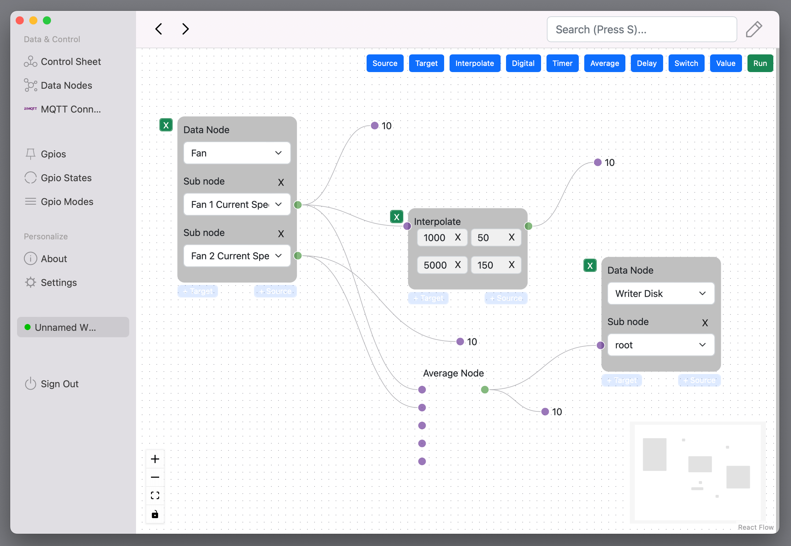

# ESP Studio

This software is an IOT product which intended to be running on ESP32 family with at least 4 MB of flash memory.

There is a web dashboard inside the project, and you need to configurate it before it appears.

## DEMO AT https://torabian.github.io/esp-studio

Attention: Demo is a mock server, to work really with ESP32 series, you need to download
binaries from releases, and flash it into your project.

## Steps

Flash the project using "esptool.exe", there is an script called
`flash_windows.bat` and if you run it, it should work without a problem.

Then, Install Nordic Semiconductor BLE android app. Search for the `ESP-STUDIO`, connect to it,
and set the wifi user name and password. There is `esp-studio-ble-definitions.json` file here, importing
that before hand really helps.

After setting SSID and Password, you can manually reset the device or with BLE action which is listed.

Now, device would be connected to your wifi. Get the IP Address from Serial port logs, or your router connected devices.

On WROOM32 devkit, GPIO4 is a built in LED. In the dashboard you can controll that.

Remember, this project tested on WROOM 32 only. If you have more than 4MB of flash memory, you might need to change
the arguments (or not?) for esptool.

## Contact me

This is a IOT dashboard, and over time will be improved towards electrical and gas industry requirements.

https://torabian.github.io or write directly: ali-torabian@outlook.com
